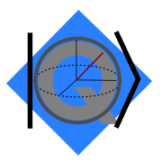

  

# .QASM
.QASM is a .Net standard library for creating and manipulating quantum circuits. 

## License
See [License](LICENSE.md) for license details.

## Technology
1. Dotnet Standard 2.1+
2. C# 8+
